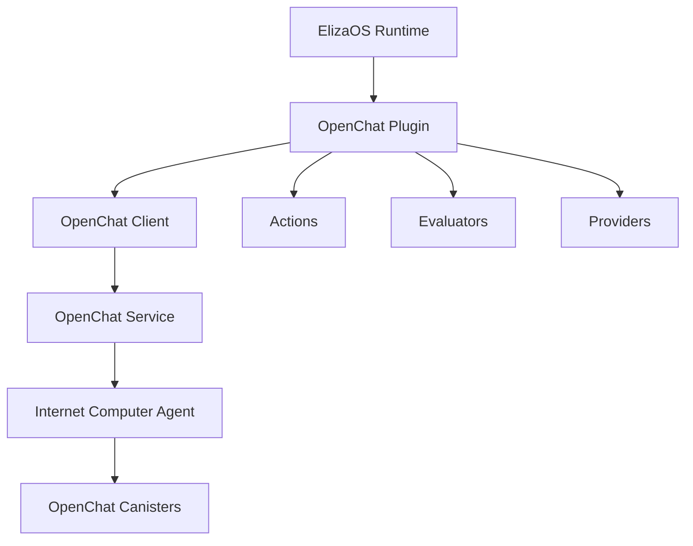
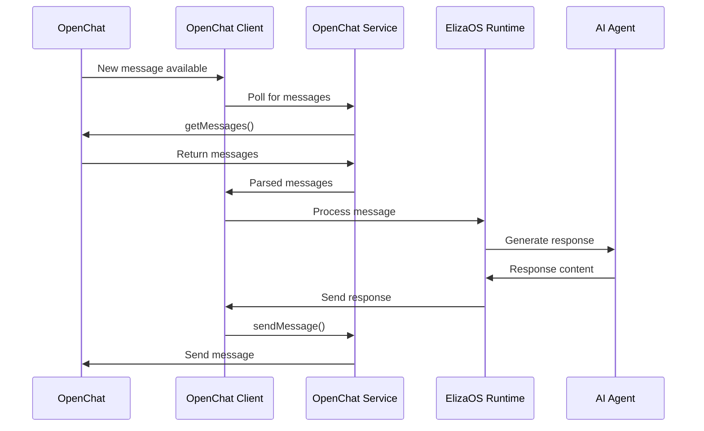
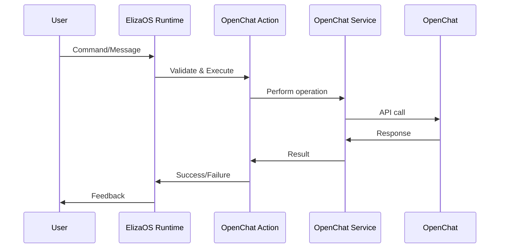
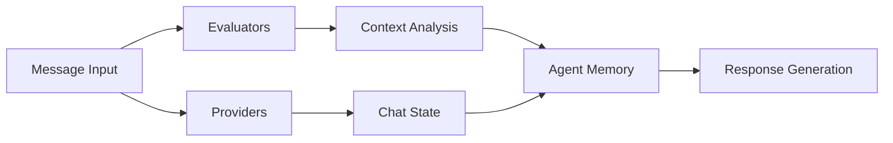

# OpenChat Plugin Architecture

This document provides a detailed overview of the OpenChat plugin architecture for ElizaOS.

## Table of Contents

1. [Overview](#overview)
2. [Core Components](#core-components)
3. [Data Flow](#data-flow)
4. [Integration Points](#integration-points)
5. [Security Considerations](#security-considerations)
6. [Performance Considerations](#performance-considerations)
7. [Extension Points](#extension-points)

## Overview

The OpenChat plugin enables ElizaOS agents to interact with the OpenChat platform on the Internet Computer. It follows the standard ElizaOS plugin architecture while implementing OpenChat-specific functionality.

### Design Principles

- **Modularity**: Each component has a single responsibility
- **Extensibility**: Easy to add new actions and evaluators
- **Reliability**: Robust error handling and recovery
- **Performance**: Efficient message processing and caching
- **Security**: Safe handling of credentials and user data

## Core Components

### 1. Plugin Structure

```
@elizaos/plugin-openchat
├── src/
│   ├── actions/          # ElizaOS actions
│   ├── evaluators/       # Context evaluators
│   ├── providers/        # Context providers
│   ├── services/         # Core services
│   ├── types/           # TypeScript definitions
│   ├── client.ts        # Main client implementation
│   └── index.ts         # Plugin entry point
├── examples/            # Usage examples
└── docs/               # Documentation
```

### 2. Component Hierarchy



## Core Components

### 1. OpenChat Client (`client.ts`)

The main client class that orchestrates all OpenChat interactions.

**Responsibilities:**
- Connection management to OpenChat canisters
- Message polling and event handling
- Integration with ElizaOS runtime
- Error handling and recovery

**Key Methods:**
```typescript
class OpenChatClient {
    async start(): Promise<void>
    async stop(): Promise<void>
    async sendMessage(chatId: string, content: string): Promise<boolean>
    async joinGroup(groupId: string): Promise<boolean>
    private async pollForMessages(): Promise<void>
    private async handleMessage(message: OpenChatMessage): Promise<void>
}
```

**Event System:**
```typescript
// Events emitted by the client
client.on('connected', () => {})
client.on('disconnected', () => {})
client.on('message', (event: OpenChatEvent) => {})
client.on('error', (error: Error) => {})
```

### 2. OpenChat Service (`services/openchat.ts`)

Core service for direct interaction with OpenChat canisters.

**Responsibilities:**
- Direct API calls to OpenChat canisters
- Candid interface management
- Authentication handling
- Response parsing and validation

**Architecture:**
```typescript
class OpenChatService implements OpenChatClient {
    private agent: HttpAgent
    private actor: any
    private canisterId: string
    
    // Core methods for OpenChat operations
    async sendMessage(request: SendMessageRequest): Promise<SendMessageResponse>
    async getMessages(chatId: string): Promise<OpenChatMessage[]>
    async joinGroup(groupId: string): Promise<boolean>
    // ... other methods
}
```

### 3. Actions (`actions/`)

ElizaOS actions that can be triggered by the agent.

**Structure:**
```typescript
interface Action {
    name: string
    similes: string[]
    description: string
    validate: (runtime: IAgentRuntime, message: Memory) => Promise<boolean>
    handler: (runtime, message, state, options, callback) => Promise<boolean>
    examples: ActionExample[][]
}
```

**Available Actions:**
- `sendMessageAction`: Send messages to OpenChat
- `joinGroupAction`: Join OpenChat groups
- `addReactionAction`: Add reactions to messages

### 4. Evaluators (`evaluators/`)

Components that analyze messages and provide context.

**OpenChat Evaluator:**
```typescript
const openChatEvaluator: Evaluator = {
    name: "OPENCHAT_CONTEXT"
    description: "Evaluates OpenChat message context"
    validate: (runtime, message) => Promise<boolean>
    handler: (runtime, message) => Promise<Memory[]>
}
```

**Analysis Features:**
- Conversation sentiment analysis
- Topic extraction
- User engagement tracking
- Message frequency analysis

### 5. Providers (`providers/`)

Context providers that supply information to the agent.

**OpenChat Provider:**
```typescript
const openChatProvider: Provider = {
    get: async (runtime, message, state?) => {
        // Provides context about current chat state
        // Recent messages, user info, chat activity
        return contextString
    }
}
```

## Data Flow

### 1. Message Reception Flow



### 2. Action Execution Flow



### 3. Context Flow



## Integration Points

### 1. ElizaOS Runtime Integration

**Plugin Registration:**
```typescript
export const openChatPlugin: Plugin = {
    name: "openchat",
    description: "OpenChat integration",
    actions: [...],
    evaluators: [...],
    providers: [...],
    clients: [OpenChatClient],
}
```

**Runtime Interaction:**
- Actions are registered and can be triggered by the agent
- Evaluators process incoming messages
- Providers supply context for decision making
- Clients handle real-time communication

### 2. Internet Computer Integration

**Agent Setup:**
```typescript
const agent = new HttpAgent({
    host: 'https://ic0.app',
    fetchRootKey: false, // true for local development
})
```

**Canister Communication:**
- Uses Candid interface for type-safe communication
- Handles Principal-based authentication
- Manages canister method calls
- Processes responses and errors

### 3. OpenChat Platform Integration

**Key Integration Points:**
- Message sending and receiving
- Group/channel management
- User authentication
- Reaction handling
- File/media support (future)

## Security Considerations

### 1. Authentication

**Identity Management:**
- Uses Internet Computer identity system
- Secure principal-based authentication
- No password storage required
- Supports multiple identity providers

**Best Practices:**
```typescript
// Use environment variables for sensitive data
const canisterId = process.env.OPENCHAT_CANISTER_ID
// Never log sensitive information
// Validate all inputs before processing
```

### 2. Data Protection

**Message Handling:**
- Messages are processed in memory only
- No persistent storage of chat content
- Respect user privacy settings
- Implement data retention policies

**Network Security:**
- All communication over HTTPS
- Certificate validation enabled
- No plain text credential transmission

### 3. Permission Management

**Access Control:**
- Respect OpenChat group permissions
- Implement rate limiting
- Validate user permissions before actions
- Handle permission errors gracefully

## Performance Considerations

### 1. Message Polling

**Optimization Strategies:**
```typescript
// Configurable polling interval
const pollInterval = parseInt(process.env.OPENCHAT_POLL_INTERVAL || "5000")

// Batch message processing
const messages = await service.getMessages(chatId, lastIndex, 50)

// Skip processing of old messages
const newMessages = messages.filter(msg => msg.timestamp > lastProcessed)
```

### 2. Memory Management

**Efficient Processing:**
- Process messages in batches
- Limit memory retention
- Clean up old conversation data
- Implement garbage collection triggers

### 3. Network Optimization

**Reducing API Calls:**
- Batch operations when possible
- Cache frequently accessed data
- Use WebSocket connections (future)
- Implement exponential backoff for retries

## Extension Points

### 1. Custom Actions

Add new actions by implementing the Action interface:

```typescript
export const customAction: Action = {
    name: "CUSTOM_OPENCHAT_ACTION",
    similes: ["CUSTOM", "SPECIAL"],
    description: "Custom OpenChat operation",
    validate: async (runtime, message) => {
        // Validation logic
        return true
    },
    handler: async (runtime, message, state, options, callback) => {
        // Implementation logic
        return true
    },
    examples: [...]
}
```

### 2. Custom Evaluators

Extend analysis capabilities:

```typescript
export const customEvaluator: Evaluator = {
    name: "CUSTOM_ANALYSIS",
    description: "Custom message analysis",
    validate: async (runtime, message) => true,
    handler: async (runtime, message) => {
        // Analysis logic
        return [analysisResult]
    }
}
```

### 3. Custom Providers

Add new context sources:

```typescript
export const customProvider: Provider = {
    get: async (runtime, message, state) => {
        // Context gathering logic
        return "Custom context information"
    }
}
```

### 4. Plugin Extensions

Extend the main plugin:

```typescript
import { openChatPlugin } from '@elizaos/plugin-openchat'

export const extendedOpenChatPlugin: Plugin = {
    ...openChatPlugin,
    actions: [
        ...openChatPlugin.actions,
        customAction,
    ],
    evaluators: [
        ...openChatPlugin.evaluators,
        customEvaluator,
    ]
}
```

## Future Architecture Enhancements

### 1. WebSocket Support

Real-time message streaming instead of polling:

```typescript
class OpenChatWebSocketClient {
    private ws: WebSocket
    
    async connect() {
        this.ws = new WebSocket('wss://openchat.ws')
        this.ws.on('message', this.handleMessage)
    }
}
```

### 2. Multi-Agent Coordination

Support for multiple agents in the same chat:

```typescript
interface AgentCoordinator {
    registerAgent(agent: OpenChatAgent): void
    routeMessage(message: OpenChatMessage): OpenChatAgent
    preventDuplicateResponses(): void
}
```

### 3. Advanced Analytics

Enhanced conversation analysis:

```typescript
interface ConversationAnalytics {
    sentiment: SentimentAnalysis
    topics: TopicModeling
    userEngagement: EngagementMetrics
    conversationFlow: FlowAnalysis
}
```

### 4. Plugin Marketplace

Extensible plugin system:

```typescript
interface PluginExtension {
    name: string
    version: string
    dependencies: string[]
    install(): Promise<void>
    activate(): Promise<void>
}
```

This architecture provides a solid foundation for OpenChat integration while maintaining flexibility for future enhancements and customizations.